# Abstract 

This article presents the design of an all-digital, SRAM-based compute-in-memory (CIM) accelerator for neural networks and machine learning. A material limitation in the SRAM-CIM scheme, present but not featured in prior research, is uncovered and analyzed. Salient features of the SRAM-CIM design style for power-efficient accelerators are extracted, and applied to a VLSI-flow-compatible all-digital accelerator achieving over 100x energy-efficiency improvement over comparable systolic array designs in the same 28nm CMOS technology. 

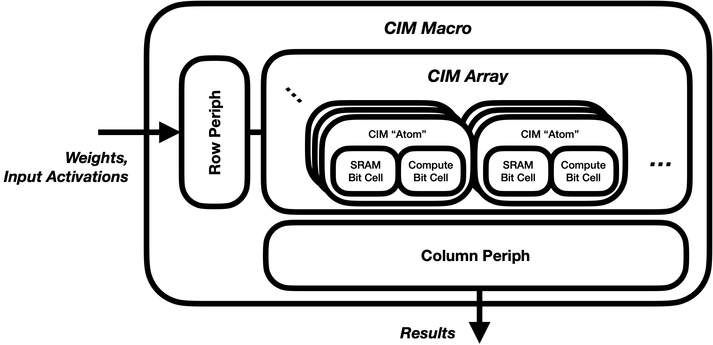

# Introduction 

Increased demand for high-performance neural-network training and inference has driven a wide array of machine-learning acceleration hardware. Typical such ML accelerators feature large data-parallel arithmetic hardware arrays, such as those for performing rapid dense-matrix multiplication. 
Two commonly linked, although conceptually separable, classes of such accelerators have risen to prominence in recent research: those utilizing analog signal processing, and those utilizing "compute-in-memory" circuits which break the classical Von Neumann split between processing and memory-storage, incorporating logic functions among memory arrays. 


## Analog Signal Processing

Analog methods for neural-network acceleration, particularly that of matrix-matrix multiplication, commonly deploy analog-domain processing for one or both of their MACC's attendant arithmetic operations: multiplication and/or addition. Analog multiplication is typically performed via a physical device characteristic, e.g. transistor voltage-current transfer [@chen2021], or that of an advanced memory cell such as RRAM[@yoon2021] or ReRAM [@xue2021]. Addition and accumulation are most commonly performed either on charge or current, the two analog quantities which tend to sum most straightforwardly. More elaborate systems use time-domain signal-processing [@sayal2020] for their arithmetic operations. 

In principle these analog-domain operations can be performed at both high speed and high energy-efficiency. Their primary cost, somewhat paradoxically, is a substantial reduction in fidelity. Despite representing each of their values in functionally infinite-resolution physical quantities, analog processing commonly forces signals to be quantized to just a few bits. As the native format of both upstream and downstream processing is digital, these accelerators require a domain-conversion of both their inputs (via DACs) and outputs (via ADCs). Resolution and performance of these converters is a material design constraint. This largely drives the analog techniques' second pitfall: their substantially higher design cost, both for the data converters and core arithmetic cells. 

Prior research [@rekhi2019] has set an upper bound on the resolution-efficiency trade-off for such analog-computation accelerators, by (a) presuming the analog-to-digital conversion as the energy-limiting step, and (b) assuming state-of-the-art ADC performance and efficiency. But this bound is likely far too loose. Such accelerators (a) have other energy-consuming elements besides their ADCs, but more importantly, (b) do not necessarily (or even likely) feature appropriate trade-offs for state-of-the-art data conversion. Such converters often consume substantial die area, and/or require elaborate calibration highly attuned to their use-cases. 

Furthermore, a substantial complication is altogether ignored: analog computation is inherently non-deterministic. Analog signals and circuits have irrecoverable sources of thermal, flicker, and shot noise, which can only be budgeted against, but never fully removed. The analysis presented in [@rekhi2019] implicitly buckets all "AMS Error" as that commonly called *quantization error* or *quantization noise* in data-conversion space. While often fairly intractable across a large batch of devices, these errors are deterministic for a given device once fabricated, while held under unvarying conditions. Thermal noise, in contrast, varies per operation, including between multiplications in the same inference cycle. 


## Compute-in-Memory 

Digital compute-in-memory circuits, in contrast, retain the digital-word representation of each quantity, and retain the boolean-logic implementation of their core arithmetic function. Their distinct characteristic is that said arithmetic is dispersed among a memory-and-compute array, the atoms of which are not generally available to common digital-design flows (synthesis, place-and-route layout). Digital CIM cells appear to their surrounding systems more similar to SRAM arrays which internally perform some amount of computation. The internal atoms of these circuits generally include (a) one or more high-density storage elements, similar to those of a typical SRAM bit-cell, and (b) a paired atom of computation, often a single-bit or small-resolution multiplication. Peripheral circuits include those similar to typical SRAMs, designed to read or write words at a time, as well as those designed for combining atomic-level operations, such as accumulation of partial products. Figure~\ref{fig:concept} illustrates the conceptual digital CIM. 

The primary question for digital CIM arrays is whether they offer sufficient benefit to justify their design cost. Such circuits require leaving typical digital-design flows and adopting a custom design process similar to that of SRAM, a field now commonly reserved for the largest and best-resourced industrial teams. (Although notably still less complex than a full-analog design process.) SRAM arrays however include a material constraint which CIM accelerators need not: SRAM bit-cells are generally designed to be instantiated billions of times over, and accordingly designed to incredibly high yield. Many such cells are designed to fail only when outside of six or seven standard-deviations worth of manufacturing tolerances. Even these low failure rates justify the overhead of redundancy and error-correction peripheral circuits. CIM accelerators, in contrast, are likely to include several orders of magnitude fewer bits, and may allow for correspondingly higher failure rate of their atomic-units. The circuit-level arrangement of these atomic-units can and does in many cases also ease common SRAM-design constraints, such as the tension between bit-cell readability and writability. 

While CIM and analog-processing are commonly intertwined, we again note their conceptual separability. Analog matrix-multiply arrays typically incorporate local weight storage, hence their "in-memory" naming. But this weight-storage is typically tied to the size of the compute-array, and is much smaller than even modest local SRAM buffers. These "memories" are often more analogous in size and function to the register-based buffers distributed throughout a systolic array. 

Targeting high area and energy efficiency while avoiding the pitfalls of analog computation, this work proposes an all-digital SRAM-based CIM macro. 
The macro is designed and benchmarked against prior systolic-array-based research accelerator Gemmini ([@genc2019gemmini]) in TSMC 28nm and Skywater 130nm CMOS technologies. The latter design-kit is provided as near-fully open-source software. 


# Proposed All-Digital CIM Macro 

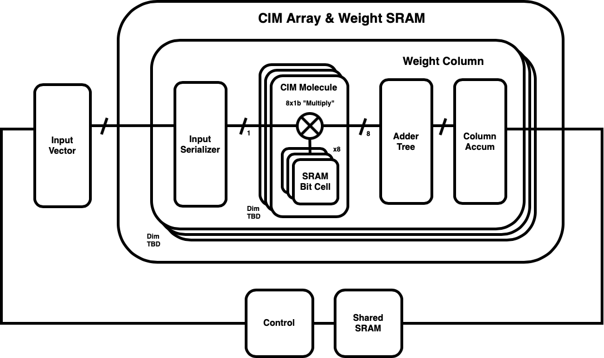

Figure~\ref{fig:macro} illustrates a block diagram of the CIM macro. Its primary memory-and-compute array is comprised of a set of weight columns, each of which includes: 

* An input-activation serializer
* `NROWS` CIM "molecules" comprising eight-bit weight storage and compute, and 
* A per-column reduction circuit comprising an adder tree and shift-accumulator

The macro stores and operates on weights directly in its CIM array, and includes additional shared SRAM for input activations, partial matrix-products, weight overflow, and any ancillary data. Like [@chih2021] and [@kim2019], this work operates *bit-serially* on its input activations. Bit-serial operation is chosen to maximize area-efficiency of the atomic compute operations. 

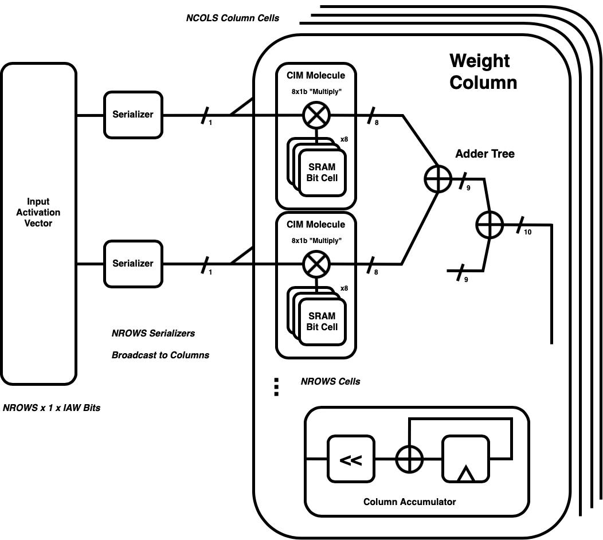

Figure~\ref{fig:column} shows each CIM column in greater detail. In each cycle, the `NCOLS` columns are broadcast a single bit each from `NROWS` input activations. The column multiplies these `NROWS` bits by `NROWS` eight-bit weight-words, stored in its SRAM-based CIM atoms. These `NROWS` eight-bit products are then summed by a fully-combinational adder tree into an `NROWS + log2(NCOLS)`-bit partial product, which is shifted per its input-activation bit-weight, and accumulated onto past partial sums. Note despite the macro's nominal function being matrix-vector multiplication, it includes no traditional hardware multiplier. Bit-serialized partial sums are instead shifted and accumulated into each column shift-accumulator. For `NBITS`-width input activations, computing a matrix-vector product of dimensions `1 x NROWS` by `NROWS x NCOLS` to create an `NCOLS`-length row-vector requires `NBITS` clock cycles. 

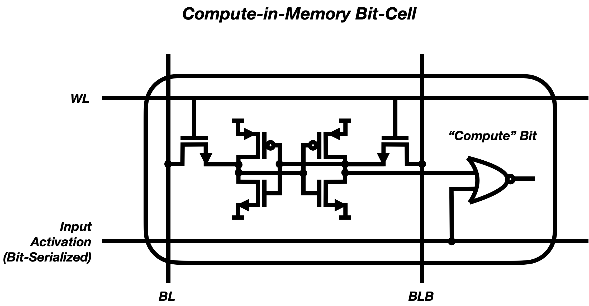

The macro is designed to maximally simplify its primary unit, the CIM Atom (or bit-cell). Figure~\ref{fig:atom} depicts the CIM atom circuit. It comprises a six-transistor SRAM bit-cell and an atomic compute-bit, performing a single-bit multiplication. Because input activations are bit-serialized, the width of each partial-product is equal to that of a weight-word, and multiplication can hence be performed with a single logic gate. Given appropriate polarity of weights and inputs, either of the primary universal gates NAND and NOR provide the necessary multiplication function. This work uses the minimum-sized NOR2 gate. Note each compute-bit operates directly its paired SRAM bit-cell's internal state, reaching around its access transistor. Weights are written but never read from the CIM SRAM bits; it operates as a  write-only SRAM. Its paired SRAM peripheral circuitry can be reduced to reflect this use model, removing any read-circuits such as sense amplifiers and column muxes. 


## Performance vs the Systolic Array 

The `NROWS x NCOLS`-sized CIM and systolic arrays both produce a series of `NCOLS`-length result vectors. The systolic array produces one such vector per cycle, while for `NBITS`-wide input activations, the CIM array produces a vector result every `NBITS` cycles. The CIM array throughput is reduced the same factor `NBITS`. Defining an operation as a scalar weight-width multiplication or addition, the CIM arrays' operations per cycle equals that of the systolic array in the case in which its array-dimensions are `NBITS` times larger. For larger dimensions, its ops/cycle are greater, and for smaller dimensions they are lower. In this work both CIM and systolic array weight and input sizes (`NBITS`) are set to eight bits. While this requires a CIM array of at least 8 times as many elements, we note that each element in the systolic array includes substantially more hardware: an 8x8 bit hardware multiplier, larger-width accumulator, and registers for enacting the two-dimensional systolic pipelining. The CIM unit, in contrast, requires only a storage-compute molecule plus its share of the reduction logic, amortized over `NROWS` such molecules. 


## Atom vs Reduction Area 


In each of the two evaluation technologies, the minimum-sized standard logic gate is roughly 2x that of the single-port SRAM bit cell. Presuming that its widespread re-use has pushed the SRAM bit-cell to near its manufacturability-dictated minimum size, and that a single two-input logic gate can be similarly optimized onto minimum size, we plan for a CIM atom of roughly 2x the SRAM bit-cell area. Product-outputs from pairs of these CIM atoms are then fed into the inputs of a binary adder tree. Both evaluation technologies provide full-adder cells as part of their standard libraries; in both cases the area of such cells is roughly *12x* that of the SRAM bit-cell. Figures ~\ref{fig:atomic-sizes} shows these cells to scale in the 130nm technology. At such proportions, the adder tree's input stage alone requires roughly 3x the area of the CIM atoms. While these cells might also be redesigned for minimal area, it remains unlikely that they would near that of the single-bit multiplier or SRAM bit-cell. The NAND/NOR realization of such a gate requires nine such cells; common XOR-based implementations commonly use in excess of 20 transistors. 

Initial VLSI-flow-based layout of 64-row CIM columns yielded adder-tree areas between 24x and 81x the SRAM area, depending on their target frequency. The relatively wide range illustrates a material constraint in the adder-tree design: the fastest such circuits generally trade area in exchange for speed. Carry-select is a prominent example, widely generated by logic synthesis; it roughly doubles the adder area by including two parallel adders, multiplexed to select for the carry input value. Low-area adders tend to be slow adders. The lowest-area known to the author is also the most basic: the ripple-carry. [@chih2021] makes explicit their use of such in their reduction tree. 

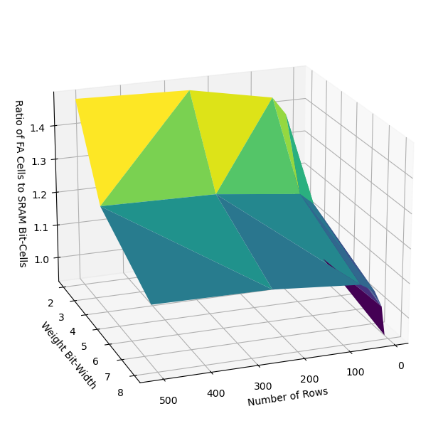
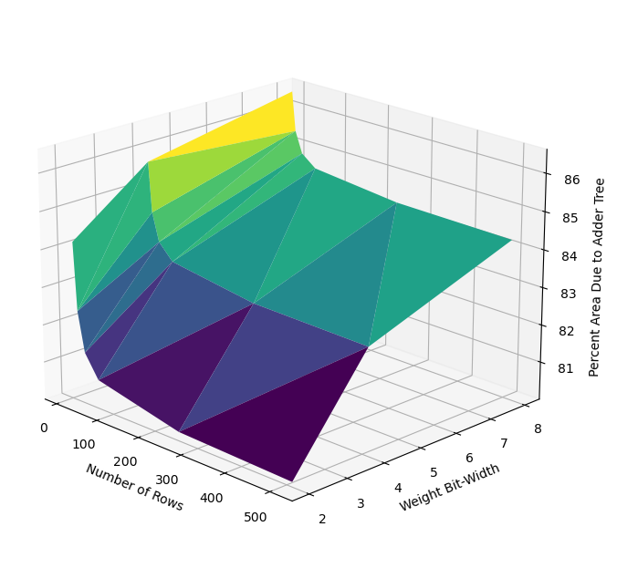

Figures ~\ref{fig:area-cell-ratio} and ~\ref{fig:area} depict the proportion of area dedicated to the reduction adder-tree for all relevant parametric combinations of `NBITS` and `NROWS`, using the minimum-area architecture ripple adder. In each case the *quantity* of SRAM bit and full-adder unit-cells has a ratio between 1:1 and 1.4:1. The larger unit-area of the full-adder, here presumed to be 6x that of the bit-cell, renders its area contribution between 80 and 85 percent of the array. This estimate for the area ratio is subject to both upward and downward pressure, as (a) a custom adder unit-cell can be designed at lower area than the standard-library's, as in [@chih2021], but (b) arrangement of the binary-tree of these cells onto a rectangular array would likely incur significant overhead. 

Prior work such as [@chih2021] designs such a ripple-based adder-tree and a custom full-adder cell therefore. While no analysis is provided regarding its area breakdown, a total of 64Kb worth of 0.379µm2 bit-cells are included in an overall 202k µm2 macro, comprising roughly 12 percent of its overall area. We expect the remaining area and relatively low proportion of memory-area is, as in this work, primarily due to the area demands of the adder tree. 


## CIM Column Design 

Code listing 1 shows highlights of the largely gate-level SystemVerilog design of the CIM column. Verilog's `generate` expansion-statements produce the gate-level adders and single-bit multipliers, while offline scripting produces the binary adder tree. The two crucial leaf-level cells `fa` and `mult1b` are thin wrappers around foundry standard-library gates. The shift-accumulators and other retiming are designed in behavioral SystemVerilog and passed through logic synthesis. 

```verilog
module ripple_add #( /* ... */ ); 
  generate
  for (k=0; k<WIDTH; k=k+1) begin
    fa i_fa( /* ... */ );
  end
  endgenerate 
endmodule

module ripple_adder_tree ( /* ... */ );
  assign layer0out = summands;
  logic signed [31:0] [8:0] layer1out;
  ripple_add #(.WIDTH(8)) 
    i_ra_1_0 ( /* ... */ );
  /* ... */
  logic signed [13:0] layer6out;
  ripple_add #(.WIDTH(13)) 
    i_ra_6_0 ( /* ... */ );
  assign sum = layer6out [13:0];
endmodule

module column #( /* ... */ ); 
  /* ... */
  // Single-Bit Multiplies 
  logic signed [NROWS-1:0][WORDLEN-1:0] 
    products;
  genvar j, k;
  generate
  for (j=0; j<NROWS; j=j+1) begin
    for (k=0; k<WORDLEN; k=k+1) begin
      mult1b i_mult1b (
        .A1 (ia_m1[j]), 
        .A2 (weight[j][k]), 
        .ZN (products[j][k])
      );
    end
  end
  endgenerate 
  /* ... */
endmodule
```


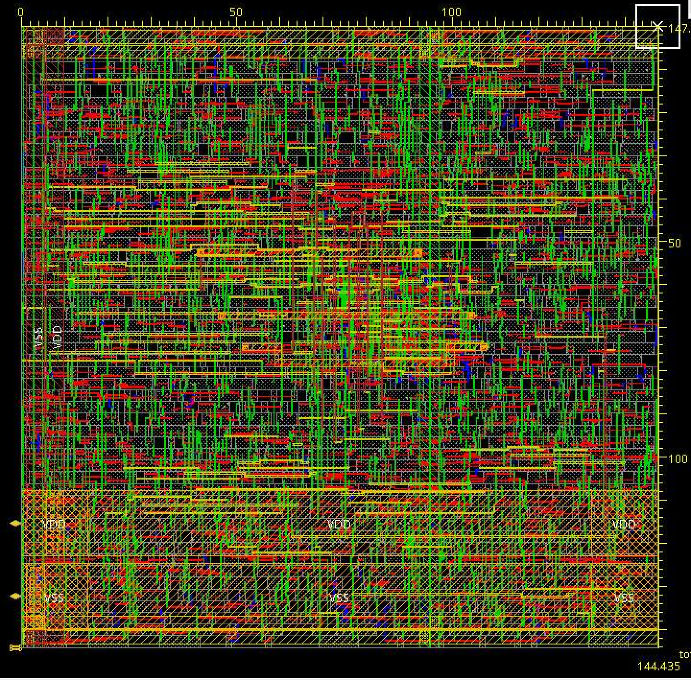

Weight storage is left external to these initial column designs, to first demonstrate the likely power, performance, and area of the remaining column circuitry. Columns generated by a standard VLSI flow place-and-route tool in the 28nm and 130nm technologies are shown in Figures ~\ref{fig:col-tsmc28} and ~\ref{fig:col-sky130}, respectively. Each includes 64 rows with eight-bit weight-words. The 28nm column occupies roughly 2.5k µm2 while the 130nm technology's requires roughly 22.5k µm2. 

Critical-path delay through the 28nm column is slightly longer than 900ps, allowing operation up to roughly 1.1GHz. The 130nm column is roughly 1/20th the speed, running at up to roughly 50MHz. Each omits the input-activation serialization and distribution timing present at the array-level, which further limits the speed of full arrays, particularly large ones. 

For each of the evaluation technologies, the column area is more than 20x that of its paired SRAM, rendering the overall array-area roughly 95\% dedicated to compute, and only 5\% to memory. This calls into question the viability of designing such an array onto maximally-optimized SRAM, given the demand to map its 95\% logic content into typically much-denser SRAM layout. 


# Alternate Array Designs 


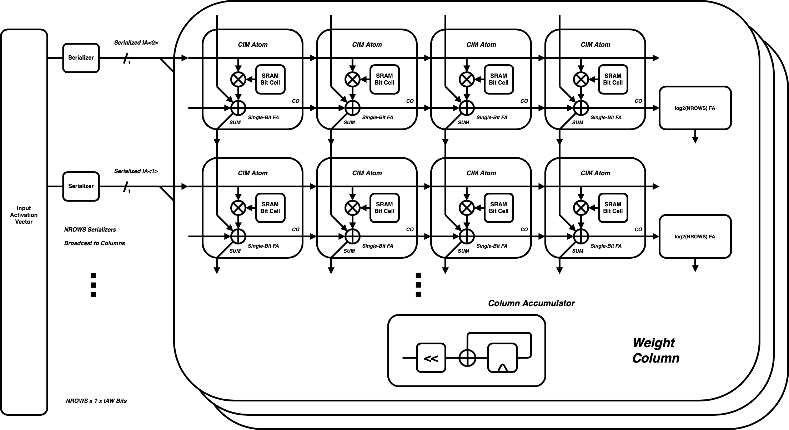
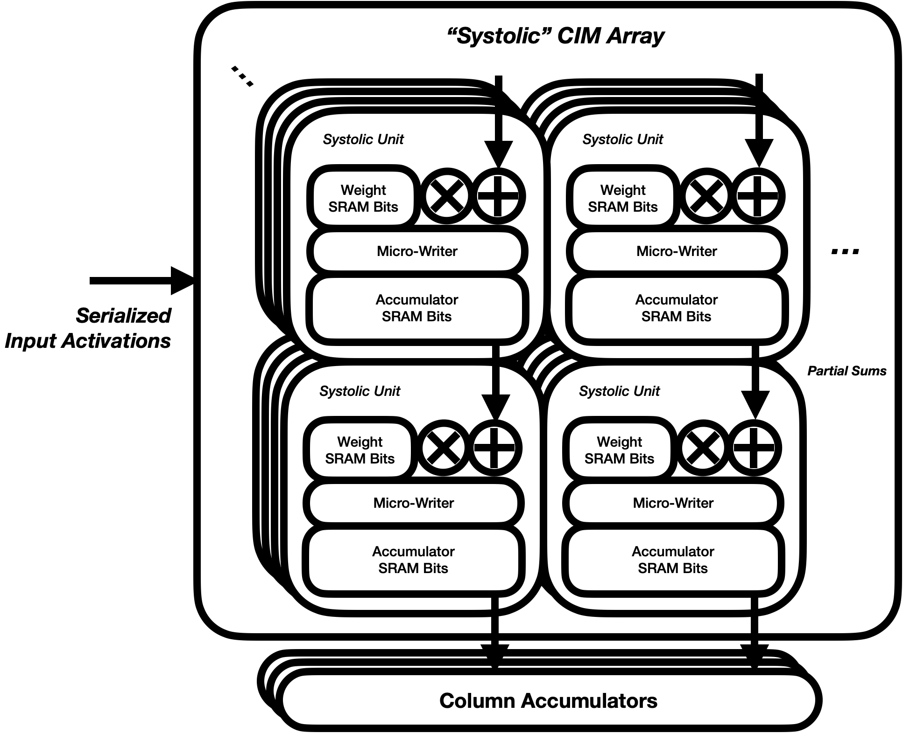

The heavy weighting of compute relative to memory motivates a survey of potential alternate array designs. 
Figure~\ref{fig:altcolumn} depicts a concept CIM array in which the reduction tree is atomized into each bit-cell. The CIM atoms then comprise the prior SRAM bit-cell and multiplier, plus a newly-added full-adder cell. This arrangement is highly similar to that presented in [@kim2019] and [@kim2021]. Partial products are passed down the array while carries are propagated across weight-words. The array retains the bit-serial input-activation application, and the per-column shift-and-accumulate multiplier. 

Such an array theoretically maximizes the proportion of its area dedicated to CIM atoms. However not all such atoms can be fully utilized. In [@kim2021], the row-ending adders are also comprised of CIM atomic cells. The weight-storing and add-only atoms are categorized as one of Types I or II. For the latter, multiplication is disabled. Per row, `log2(NROWS)` of these adder-only atoms are required. For eight-bit weights, this requires a 7/15 overhead. These overheads remain constant in size as weight-widths shrink; binary networks therefore require a full 7/8 overhead. This can be visualized as such: the sum of 128 eight-bit words will require `log2(128) + 8 = 15` bits. Rather than arrange the progressively increasing width in a tree, *each* row includes all 15 bits. The total reduction function also includes a carry-path through most elements in the array, limiting is speed. Clock frequencies reported in [@kim2021] rise only to the tens of megahertz, despite being implemented in a 65nm process with gate-delays of under 50 picoseconds. 

To alleviate such slow-downs, one might imagine a *systolic-in-memory array* such as that depicted in Figure~\ref{fig:systolic}. Such an array applies pipelining to one or both of its dimensions. Setting aside whether the relatively low-cost single-bit input activations are pipelined, we note that solely adding internal pipelining to the partial product accumulations incurs a substantial hardware overhead. Each atom must include its own adder and accumulator register. Like Figure~\ref{fig:altcolumn}, these accumulators must each be of width `NBITS + log2(NROWS)`. For typical array sizes, this width will be roughly twice `NBITS`, rendering roughly 2/3 of memory usage to internal partial sums. If SRAM is used to implement these accumulators, additional "micro writers" must be designed which perform SRAM writes on a single (accumulator-width) word at a time. The physical design of these circuits may apply further pressure on the atom's ability to use the most-optimized SRAM cells. 

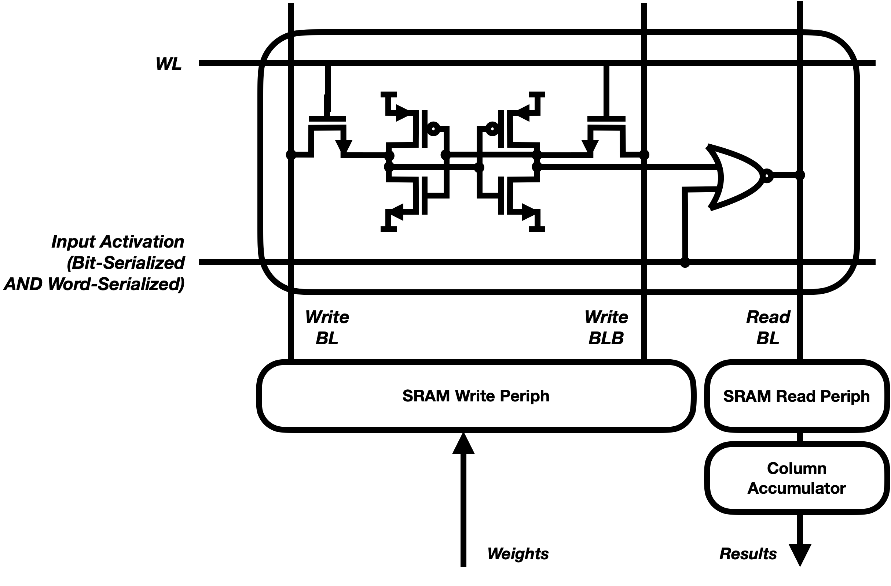
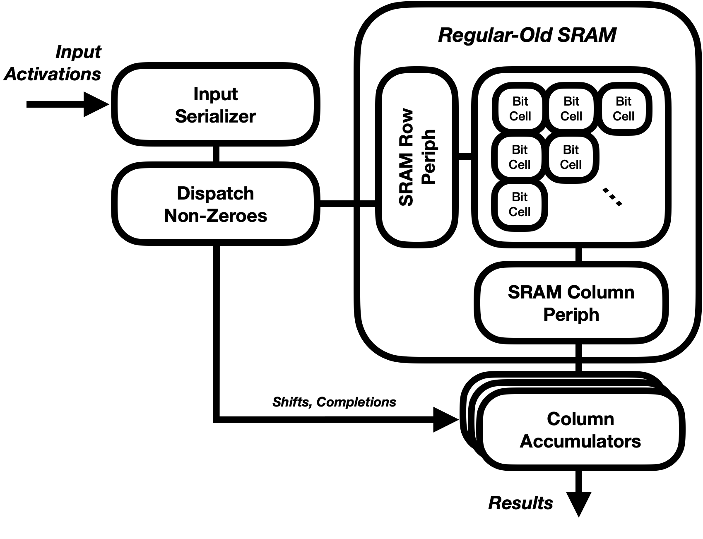

Lastly, we consider the prospects of removing *all* circuitry from the array, but for that of the atomic unit. Figure~\ref{fig:offline} depicts the concept of such an "offline reduction" array. Such operation requires that input activations be "doubly" serialized, both bit-wise and word-wise, as only a single row can be read at a time. The reduction function can then be performed in the array's peripheral circuitry. 

Examining such a design quickly produces the realization that it does not require a custom array at all. Each word read from the array of Figure~\ref{fig:offline} is one of two values: a weight-word, or zero. Further, (a) the peripheral circuit *knows* many of the zero-values, as it can examine the bit-serial input activations, and (b) zero-values are only accumulated, so we need not retrieve them at all. The combination of these realizations motivates Figure~\ref{fig:sparse}, which might more accurately be called a compute-*near*-memory accelerator. Note Figure~\ref{fig:offline} uses a standard SRAM, without any custom array or periphery. It adds three elements: (a) column shift-accumulator multipliers, similar to those reviewed throughout this work, (b) an input serializer, also reviewed throughout this work, and (c) the sole novel entry, a dispatch unit which reads weight-rows corresponding to non-zero bit-values of input-activations, and provides a corresponding stream of `shift` and `completion` packets to the accumulators. All three are compatible with a standard VLSI flow, requiring no SRAM-level design. Such a design capitalizes on the *bit-level sparsity* of input activations, performing material work solely for bits which are non-zero. Common neural network designs include many activation bits - and in fact many full activation *words* - which are equal to zero, largely due to non-linear rectification. 

This section's alternative designs are presented at the level of detail at which they have been investigated: the block-diagram level. While that of Figure~\ref{fig:sparse} is of particular future interest as a low-area, modest performance acceleration solution, the focus of this work remains on the proposed CIM array, to which we now return. 


# CIM Array Design 

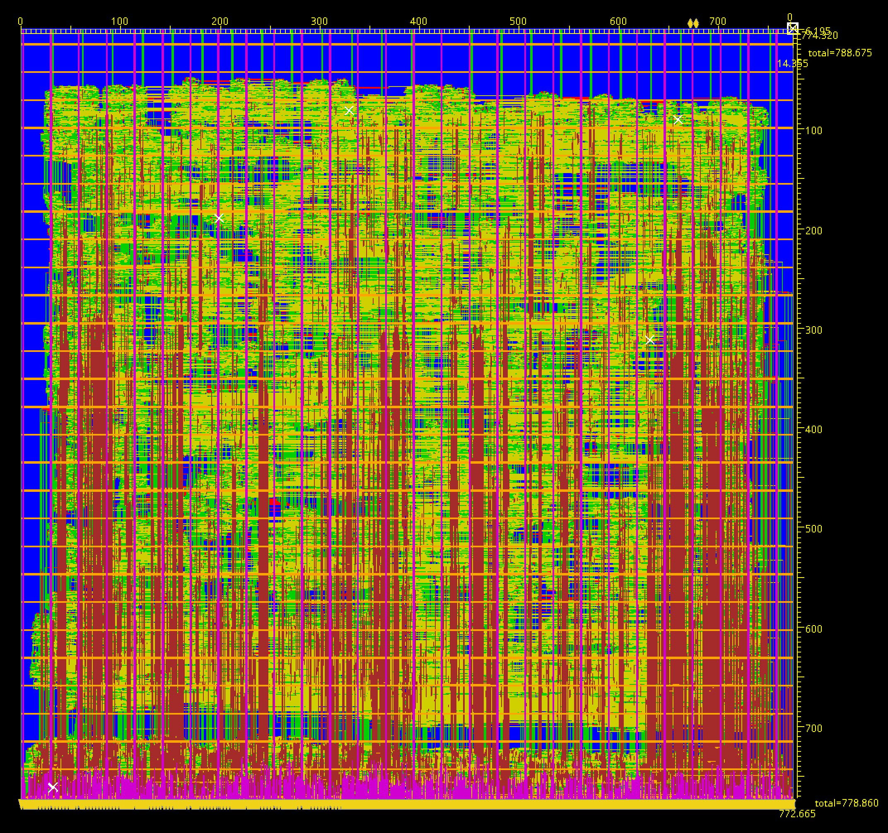
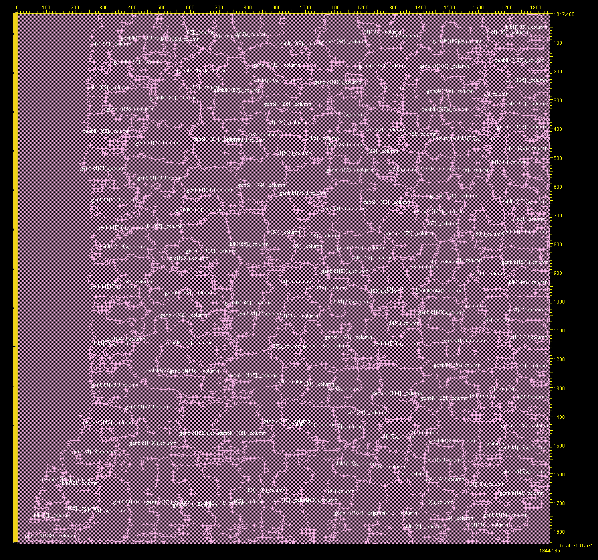

The fact that SRAM comprises so little of the proposed array motivates a move away from a semi-custom physical design in favor of a standard VLSI flow. The CIM arrays shown in Figures ~\ref{fig:array-tsmc28} and ~\ref{fig:array-sky130} take such an approach and are generated by auto-place-and-route layout. Each SRAM bit-cell is replaced with its foundry logic-library's minimum-sized latch. SRAM-style addressing of rows and columns is retained. Only a full row of the 8-bit, 128-row by 128-column matrix can be written at a time. Each CIM atom's compute-bit taps directly from output of the bit-cell latch. The macro includes no "read circuit" at all; the bit-cell latch output connects solely to its compute-bit. Bitlines are used solely during weight-update writes. Bit-serial application of `IA` is also retained; the 128 input activations travel in parallel with each `WL`. 

Figures ~\ref{fig:array-tsmc28} and ~\ref{fig:array-sky130} show the array layouts  CIM arrays in the 28nm and 130nm evaluation technologies. The 28nm array is roughly 490k µm2 (700x700µm) and the 130nm array is roughly 3.4mm2. The 128x128 dimensions are chosen to roughly match the area of the default Gemmini systolic array in the 28nm technology, which requires 518k µm2. 

The divisions shown in Figure ~\ref{fig:array-sky130} show the VLSI flow's placement of each column-circuit. Note that unlike an SRAM-style array of regular rows and columns, the automatically-generated layout places each column-circuit in a close-knit patch of aspect ratio near 1:1. This likely improves the area and routing among its reduction tree, at the cost of the routing of bitlines, wordlines, and bit-serial input activations. Despite being supplied a gate-level netlist explicitly including foundry standard-library full-adder cells, the VLSI flow also commonly chooses to break up each adder-bit into simpler gates: AOI and AND, XNOR and XNOR, or larger sets of NAND and NOR. This flexibility also likely improves the area of the column-circuits, particularly as it allows the 128 columns to be non-identical, often better-fitting around one another. A custom SRAM-style design process would be hard-pressed to include this level of layout flexibility. 

## Power, Performance, and Area Comparisons 

Table 1 summarizes the power, performance, and area of the CIM array and Gemmini systolic array in the same 28nm technology. Both arrays use eight-bit weights and input activations. The Gemmini array uses its default parameters, including a 16x16 mesh of systolic tiles. Each tile of the systolic array consists of a multiplier, accumulator, and registers for facilitating the two-dimensional systolic pipeline. In about 95\% of its area, the 128x128 CIM array includes 64x as many eight-bit "molecular" units, plus their associated reduction circuitry. Despite running at 40\% of the systolic array's clock frequency, the CIM array produces over 3x higher throughput, sped up by the 64x larger array, and slowed down by (a) the 8x penalty for bit-serializing input activations, and (b) the 60\% slower clock frequency. Operations are defined by the systolic array's convention: either a scalar multiply or a scalar addition; each MACC therefore counts as two ops. 

More important, the CIM array performs this work at roughly 1/30th the power consumption. Overall efficiency expressed in operations per Watt is therefore improved by over 100x. 

The substantially higher power efficiency can be attributed to two primary factors. First, the combinational nature of the CIM array's reduction function. Accumulation is performed in the systolic array through a two-dimensional pipeline, requiring local register storage for each of the last `NROWS` partial sums, and each of the last `NCOLS` input activations. The former is also of greater bit-width than either the input-activations or weights, as it must accommodate the largest accumulated values. In default Gemmini implementations these accumulator registers are (perhaps conservatively) set to 32 bits, 4x the weight-width. Updating all of this pipeline-state on each cycle costs energy which is not fundamental to the computation. The pipeline registers instead effectively enable a shorter clock period for the array's hardware multipliers and accumulators. The CIM array lacks all such state, but for the weight array and a per-column shift-accumulator, in this case amortized over 128 rows. 

Second is the energy-effect of the CIM array's bit-serial operation. The CIM array features no explicit hardware multiplier, and only a single data-word per column wider than the weight-word (the shift-accumulator value). Where the systolic array first computes each product in bit-parallel and then sums them word-serially, the CIM array first computes each input-activation bits' contribution to the vector-matrix product, then shifts and sums them bit-by-bit. This again reduces the state that must be updated on each cycle. As of publication time, the relative contributions of these two effects remain unknown. 

Contemporary (draft) research following onto [@genc2019gemmini] has also shown a substantial power advantage of combinational trees over systolic arrays. Differences between these works' findings and our own are differences of degree. Draft research has reported 3x lower power (75\% reduction) for Gemmini macros using combinational adder trees in lieu of the systolic array. Our own work finds a gap closer to 30x. A few factors likely explain the difference. First, [@genc2019gemmini] accounts for the power of entire Gemmini macros, where this analysis covers solely their compute array. The remainder of the Gemmini macro is roughly 50\% (by area) comprised of SRAM, and a large proportion of the remainder to memory controllers servicing out-of-order requests and responses from the memory system. These components' power is not directly affected by the compute-array design. Second, the Gemmini generator features a rich parameter-suite not included in the CIM array. Ideally the entirety of this flexibility is compiled-out at "generation" time. In practice, some features designed for larger Gemmini instances likely leak into smaller ones, such as the default implementation compared here. 

Lastly and most promisingly for future research, the authors of [@genc2019gemmini] do not compare a bit-serial design such as the proposed CIM array. While the bit-serial operation's effect on power efficiency is not fully extracted in this work, both a first-principles consideration of its theory of operation and the proposed CIM array's overall extremely high power-efficiency indicate the bit-serial style is likely providing an energy advantage. 

The CIM array includes a number of further opportunities for improvement. While the VLSI flow's placement of each CIM column in nearly 1:1 aspect ratio improves the locality of its reduction tree, it also applies great pressure on the routing of the bit-serial input activations, wordlines, and bitlines. In the 28nm design, distribution of the input-activation comprises over 2/3 of the roughly 2.2ns critical path delay. (Writes to the weight SRAM using the wordlines and bitlines do not include the adder-tree delays and are hence not on the critical path.) A more structured physical design with more directed `IA`, `WL`, and `BL` routing, whether dictated through semi-custom layout or VLSI flow constraints, would likely improve these distribution delays at the cost of some area and delay through the reduction tree. 


# Conclusions 

This work endeavored to produce an all-digital compute-in-memory macro using a highly regular, semi-custom physical design methodology similar to that common for SRAM. This premise met a simple roadblock: bit-for-bit, compute is *much* larger than memory. Recently-published research attempts at similar SRAM-based CIM testify to this fact, as they rarely dedicate less than 90\% of their area to compute. This work has been unable to produce one with less than 95\%. Given decades of industry and economic trends, this makes sense: popular SRAM bit-cell design efforts are amortized over trillions of instances, have a compact and unchanging circuit realization, and have been ever-pressured towards higher density. Given their relative sizes, embedding computation in memory simply transfers the properties of the former to the latter. 

This realization is not without upside. An SRAM design process is laborious, and operates on a far different time-scale from that of synthesized logic, much less the rapidly changing machine learning field. (Although it remains less laborious than a common alternative using analog computation.) Given memory is only a small proportion of accelerator area, designs can garner much of SRAM-based-CIM's desirable properties while forgoing the SRAM-style design process for an automated VLSI flow. Two tactics used in recent all-digital CIM circuits - combinational reduction and bit-serial operation - both appear to offer material energy efficiency advantages. The former effect is corroborated by contemporary work, while the detailed effects of the latter require further research. Both can be adapted to future energy-efficient neural-network accelerators, including those compatible with industry-standard VLSI design flows. Semi-custom SRAM-style design styles may further improve the power-efficiency of such circuits. In a given technology, this would require the design of a small subset of a standard logic library onto SRAM pitches. This might be achieved with as little as a single minimum gate (for multiplies) and a single complex gate (for adds). 

This work's non-confidential source material is available at [https://github.com/dan-fritchman/NonAnalogComputeInMemory](https://github.com/dan-fritchman/NonAnalogComputeInMemory). The author thanks the team at TSMC for access to its 28nm technology, and the teams at Skywater and Google for their efforts promoting the open-source design-kit for the 130nm technology. Particular thanks are due to A. Gonzalez and Professor S. Shao, both of UC Berkeley, for their invaluable review and input.  

