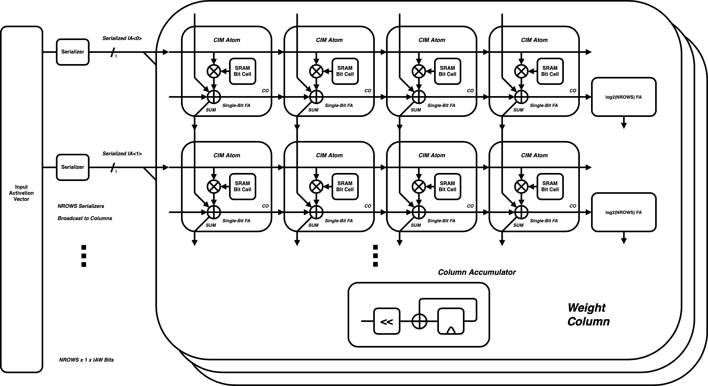

# Abstract 

This 

* tries to make an SRAM-style all-digital CIM 
* shows some ways it fails
* Shows some alternatives, and their problems
* Shows the power efficiency of a few of its constituent parts, without the SRAM

See [@rekhi2019] or [@chih2021] or [see @kim2019 p.26].  

# Introduction 

Increased demand for high-performance neural-network training and inference has driven a wide array of machine-learning acceleration hardware. Typical such ML accelerators feature large data-parallel arithmetic hardware arrays, such as those for performing rapid dense-matrix multiplication. Such accelerators frequently include more arithmetic capacity than their attached memory systems can supply, rendering them heavily memory-bound. Common tactics for confronting these memory-bandwidth limitations have included ever-larger local caches, often dominating an accelerator's overall die area. 
As machine-learning acceleration occurs in both high-performance and low-power contexts (i.e. on mobile edge devices), the speed and energy-efficiency of these operations is of great interest. 

Two commonly linked, although conceptually separable, classes of such accelerators have risen to prominence in recent research: those utilizing analog signal processing, and those utilizing "compute-in-memory" circuits which break the classical Von Neumann split between processing and memory-storage, incorporating logic functions among memory arrays. 

## Analog Signal Processing

Analog methods for neural-network acceleration, particularly that of matrix-matrix multiplication, commonly deploy analog-domain processing for one or both of their MACC's attendant arithmetic operations: multiplication and/or addition. Analog multiplication is typically performed via a physical device characteristic, e.g. transistor voltage-current transfer [@chen2021], or that of an advanced memory cell such as RRAM[@yoon2021] or ReRAM [@xue2021]. Addition and accumulation are most commonly performed either on charge or current, the two analog quantities which tend to sum most straightforwardly. More elaborate systems use time-domain signal-processing [@sayal2020] for their arithmetic operations. 

In principle these analog-domain operations can be performed at both high speed and high energy-efficiency. Their primary cost, somewhat paradoxically, is a *reduction* in fidelity. Despite representing each of their values in functionally infinite-resolution physical quantities, analog processing commonly forces signals to be quantized to just a few bits. As the native format of both upstream and downstrem processing is digital, these accelerators require a domain-conversion of both their inputs (via DACs) and outputs (via ADCs). Resolution and performance of these converters is a material design constraint. This largely drives the analog techniques' second pitfall: their substantially higher design cost, both for the data converters and core arithmetic cells. 

Prior research [@rekhi2019] has set an upper bound on the resolution-efficiency trade-off for such analog-computation accelerators, by (a) presuming the analog-to-digital conversion as the energy-limiting step, and (b) assuming state-of-the-art ADC performance and efficiency. But this bound is likely far too permissive. Such accelerators obviously (a) have other energy-consuming elements besides their ADCs, but more importantly, (b) do not necessarily (or even likely) feature appropriate trade-offs for state-of-the-art data conversion. Such converters often consume substantial die area, and/or require elaborate calibration highly attuned to their use-cases. To the author's knowledge no research-based attempts have been made to capture the performance of converters used in such accelerators relative to the state-of-the-art. 

Furthermore, a substantial complication is altogether ignored: analog computation is inherently non-deterministic. Analog signals and circuits have irrecoverable sources of thermal, flicker, and shot noise, which can only be budgeted against, but never fully removed. Some proportion of the time, an analog multiplier will inevitably report that 5 x 5 makes 26, or 24: the designer's only available knob is *how often*. This is equivalent to choosing a thermal-noise SNR, a process widely understood in data-conversion literature to *quadruple* power consumption per added bit. 

The analysis presented by Rekhi implicitly buckets all "AMS Error" as that commonly called *quantization error* or *quantization noise* in data-conversion space. While often fairly intractable across a large batch of devices, these errors are determinsitic for a given device once fabricated, while held under unvarying conditions. Thermal noise, in contrast, varies per operation, including between multiplications in the same inference cycle. To the author's knowledge no treatment of such inherently-random error sources exists in the literature on these analog techniques. While a category of *stochastic neural networks* attempts to intentionally include such noise sources, these techniques are not what popular networks or accelerators thereof attempt to compute. 

## Compute-in-Memory 

Digital compute-in-memory circuits, in contrast, retain the digital-word representation of each quantity, and retain the boolean-logic implementation of their core arithmetic function. Their distinct characteristic is that said arithmetic is dispersed among a memory-and-compute array, the atoms of which are not generally available to common digital-design flows (synthesis, place-and-route layout). Digital CIM cells appear to their surrounding systems more similar to SRAM arrays which internally perform some amount of computation. The internal atoms of these circuits generally include (a) one or more high-density storage elements, similar to those of a typical SRAM bit-cell, and (b) a paired atom of computation, often a single-bit or small-resolution multiplication. Peripheral circuits include those similar to typical SRAMs, designed to read or write words at a time, as well as those designed for combining atomic-level operations, such as accumulation of partial products. Many such circuits are designed for wide flexibility among operand-types, often serializing smaller internal operands to form larger inputs and outputs.  [@chih2021] does so on four-bit units, while [@kim2019] and [@kim2021] extend this idea all the way to single-bit serial operation. 

The primary question for such digital array is whether they offer sufficient benefit to justify their design cost. Such circuits require leaving typical digital-design flows and adopting a custom design processes similar to that of SRAM, a field now commonly reserved for the largest and best-resourced industrial teams. (Although notably still less compex than a full-analog design process.) SRAM arrays however include a material constraint which CIM accelerators need not: SRAM bit-cells are generally designed to be instantiated billions of times over, and accordingly designed to incredibly high yield. Many such cells are designed to fail only when outside of six or seven standard-deviations worth of manufacturing tolerances. Even these low failure rates justify the overhead of redundancy and error-correction peripheral circuits. CIM accelerators, in contrast, are likely to include several orders of magnitude fewer bits, and may allow for correspondingly higher failure rate of their atomic-units. The circuit-level arrangement of these atomic-units can and does in many cases ease common SRAM-design constraints, such as the tension between bit-cell readability and writability. 

While CIM and analog-processing are commonly intertwined, we again note their conceptual separability. Analog matrix-multiply arrays typically incorporate local weight storage, hence their "in-memory" naming. But this weight-storage is typically tied to the size of the array, and much smaller than even modest local SRAM buffers. These "memories" are often more analogous in size and function to the register-based buffers distributed throughout a systolic array. Note that at no point in the preceding section's treatment of analog accelerators, nor in Rekhi's analysis, has the term "memory" been invoked at all.  

## Proposed Work 

Both compute-in-memory and analog computation are back-end implementation techniques for the same popular neural network operation: matrix-matrix multiplication. Evaluation of their effectiveness is primarily a back-end, physical-design activity, requiring relevant process technology information and relatively detailed design. This work will focus on these layers, and re-use existing research infrastructure for essentially all layers above them, primarily Gemmini and its software stack. This work will primarily include: 

* Energy and performance characterization of existing research-grade accelerator(s) (e.g. Gemmini) in relevant process technology(s)
* Design of a digital compute-in-memory macro similar to that of [@chih2021] and [@kim2019], and associated characterization and comparison of its area and energy-effectiveness 
* Time-Permitting: a modeling-based study of the effects of, and limitations imposed by, thermal-noise generation in analog-based accelerators, potentially further refining Rekhi et al's outer bound on their effectiveness 

Breaking this work into segments: the first will feature the back-end evaluation of the existing accelerator(s) in the target technology(s), and outline the design of the proposed digital accelerator. The second will feature the detailed design of the digital accelerator. And the third will detail the area and energy-efficiency acheived in its design efforts, as compared to those of the existing acclerator(s). 

Like most such pieces of detailed implementation work, these efforts will largely require targeted verification. Large integrated simulations of RTL-level processors running billions of instructions (a philosophical preferrence in the BAR community) would require impractical simulation times if utilizing transistor-level models of such compute-arrays. As is common in mixed-signal environments, any such full-system evaluation will use simplified but interface-compatible RTL models of these arrays, designed to capture their characteristics as visible to the larger system: their interfaces, behavior, and relavant timing delays. Comparison of these models against their implementations then occurs separately. 

This work will require the generation of several pieces of highly repetitive, high density custom-digitial layout. Past UCB EECS work such as the Berkeley Analog Generator has designed methods for programmatic IC layout generation, but has focused on (a) analog circuits, and (b) their generality and process-portability to an extent incompatible with high-density digital layout, such as that common in SRAM. This work will instead utilize an in-progress framework for gridded, standard-cell-style semi-custom layout, and will serve as an early use-case for this framework. 

# Proposed CIM Macro 

stuff on the design, bit-serial-ness, adder/ reduction trees, etc 

# Alternate Array Designs 

Add some text here so this dont just trail off 

# Energy Comparisons 

Tree vs systolic/ Gemmini, other peoples comps and mine, etc

# Conclusions 

* As conceived this aint great
* Power efficiency of combinational/ bit-serial stuff lookin great though 
* 

